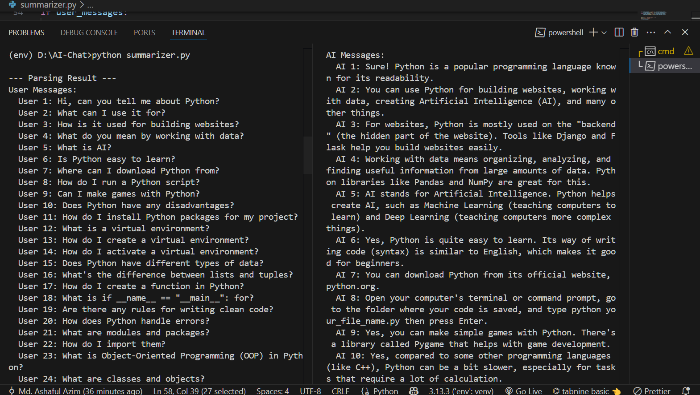
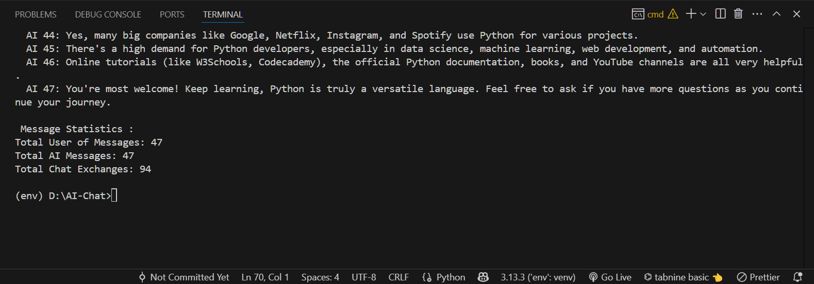
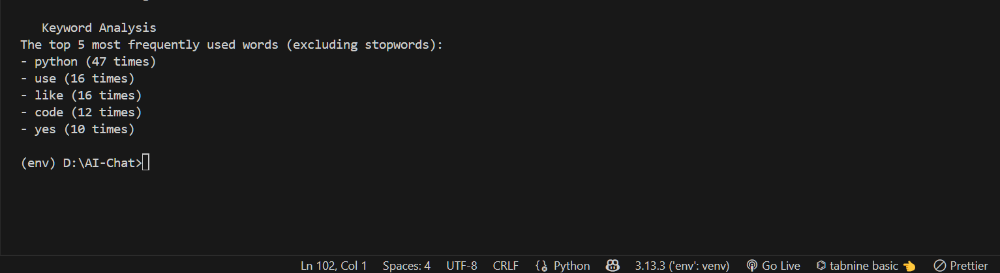
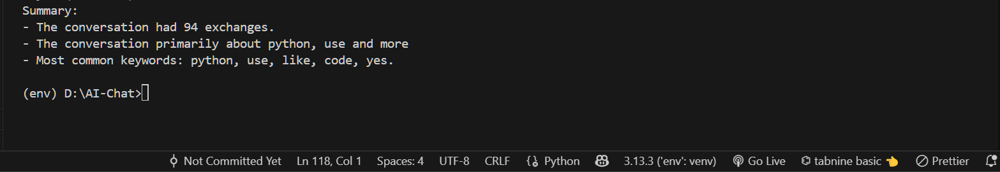

# ai-chat-log-summarizer
AI Chat Log Summarizer is a Python-based tool that reads .txt chat logs between a user and an AI, parses the conversation, and produces a simple summary including message counts and frequently used keywords. This project showcases basic NLP capabilities using Python, with an optional TF-IDF-based keyword extraction.

1.  **Chat Log Parsing (2.1)**:
    * Separate messages by speaker (User: and AI:).
    * Store messages in appropriate structures for further analysis.

2.  **Message Statistics (2.2)**:
    * Count total messages.
    * Count total messages.

3.  **Keyword Analysis (2.3)**:
    * Extract the top 5 most frequently used words.
    * Exclude common stop words (e.g., "the", "is", "and").

4.  **Summary Generation (2.4)**:
    * Generates a clear and concise summary of the chat log.
    * Includes the total number of exchanges.
    * Nature of the conversation (based on keyword topics).
    * Most common keywords.

---

## Project Structure

ai-chat-summarizer/
├── summarizer.py
├── chat.txt
├── requirements.txt
├── README.md
├── images/             
│   ├── parsing_result.png
│   ├── statistics_output.png
│   ├── keywords_output.png
│   └── summary_output.png
└── .gitignore

---

## Requirements

To run this script, you need:

* **Python 3.13.3 installed.
* All required Python libraries listed in `requirements.txt`.

The script will also automatically attempt to download necessary ...

---

## Tools Used

| Tool | Purpose |
|------|---------|
| `Python` | Primary programming language |
| `venv` | Python virtual environment management |
| `nltk` | Core library for NLP tasks (stopwords, tokenization) |
| `VS Code` | Main Integrated Development Environment (IDE) for coding |
| `Git` | Version control system for tracking changes |
| `GitHub` | Platform for hosting the repository, collaboration, and submission |
| `requirements.txt` | Defines and manages project dependencies |

---


## For Run

1.  **Clone the Repository:**

```bash
git clone https://github.com/ashaful/ai-chat-log-summarizer
cd ai-chat-log-summarizer
```
2. **Create a Virtual Environment (Recommended) and Activate the Virtual Environment:**

```bash
python -m venv env
env\Scripts\activate on Windows
```
3.  **Install Dependencies:**

```bash
pip install -r requirements.txt
```
4.  **Prepare Chat Log File:**
     - Make sure you have a `chat.txt` file in the same directory as `summarizer.py`.

5. **Run the Script:**
```bash
python summarizer.py

 ```


## Example Chat Log (`chat.txt`)

User: Hi, can you tell me about Python?
AI: Sure! Python is a popular programming language known for its readability.

User: What can I use it for?
AI: You can use Python for building websites, working with data, creating Artificial Intelligence (AI), and many other things.

## Sample Output

### Chat Log Parsing Result


### Message Statistics


### Keyword Analysis


### AI Chat Log Summary



---


